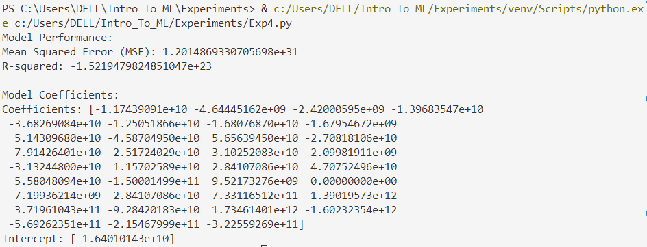

# Implementation-of-Stochastic-Gradient-Descent-SGD-Regressor

## AIM:
To write a program to implement Stochastic Gradient Descent (SGD) Regressor for linear regression and evaluate its performance.

## Equipments Required:
1. Hardware – PCs
2. Anaconda – Python 3.7 Installation / Jupyter notebook

## Algorithm
#### 1. Import Libraries

* Import pandas for data handling and scikit-learn modules for modeling and evaluation.
#### 2. Load Dataset

* Load the dataset from encoded_car_data.csv.
#### 3. Select Features and Target

* Separate features (X) and target (y) for the model.
#### 4. Split Dataset

* Divide data into training and testing sets (80-20 ratio).
#### 5. Train Model

* Fit a Stochastic Gradient Descent (SGD) Regressor on the training data.
#### 6. Make Predictions

* Predict car prices for the test set using the trained model.
#### 7. Evaluate Model

* Calculate Mean Squared Error (MSE),R-squared value
#### 8. Output Model Coefficients

* Print the model's coefficients and intercept.
## Program:
```
/*
Program to implement SGD Regressor for linear regression.
Developed by: Vishwaraj G.
RegisterNumber: 212223220125
*/
import pandas as pd
from sklearn.model_selection import train_test_split
from sklearn.linear_model import SGDRegressor
from sklearn.metrics import mean_squared_error, r2_score

# Load the dataset
file_path = 'encoded_car_data.csv'
df = pd.read_csv(file_path)

# Select relevant features and target variable
X = df.drop(columns=['price'])  # All columns except 'price'
y = df['price']  # Target variable

# Split the dataset into training and testing sets
X_train, X_test, y_train, y_test = train_test_split(X, y, test_size=0.2, random_state=42)

# Train the SGD Regressor
sgd_model = SGDRegressor(max_iter=1000, tol=1e-3, random_state=42)  # Default settings
sgd_model.fit(X_train, y_train)

# Predictions on test set
y_pred = sgd_model.predict(X_test)

# Evaluate the model
print("Model Performance:")
print("Mean Squared Error (MSE):", mean_squared_error(y_test, y_pred))
print("R-squared:", r2_score(y_test, y_pred))

# Print model coefficients
print("\nModel Coefficients:")
print("Coefficients:", sgd_model.coef_)
print("Intercept:", sgd_model.intercept_)
```

## Output:


## Result:
Thus, the implementation of Stochastic Gradient Descent (SGD) Regressor for linear regression has been successfully demonstrated and verified using Python programming.
